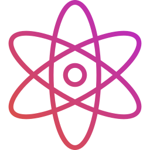

<p align="center">

</p>

A Statically typed, compiled general purpose low level programming language built using C++ and LLVM Infrastructure framework, the design was inspired from many programming languages with the goal to be simple and productive

```
import "cstdio"

fun main() {
    printf("Hello, World!\n");
}
```

### Features
- Static Types
- Type inference
- Functions
- Pointers and Function Pointer
- Struct, Packed struct and Tuples
- Single and Multi Dimensional Arrays
- Strong Enumeration
- Local and Global Variables
- Local and Global compile time constants declaraions
- Import and Load statements and blocks
- If, else if and else statements
- If Else Expression
- While statement
- For range, Forever statements
- For each statement with an optional name and step
- Switch Statement and Expression
- Break and continue statements with optional times
- Declare Prefix, Infix, and Postfix functions
- Binary, Logical, Comparisons, Bitwise Operators
- Assignments Operators =, +=, -=, *=, /=
- Singed and Un Singed Integer types
- Standard C Headers as part of the Standard library
- No implicit casting, every cast must be explicit to be clear
- Defer Statement
- Default initialization value for global and local variables
- Resolving Constants Index, If Expressions at Compile time
- Generic Programming

## Inspiration
The design of Amun is inspired by a number of languages such as `C`, `C++`, `Go`, `Rust`, `Jai`,
special thanks for every create language designer and for every open source project that share
the creativity and knowledge.
